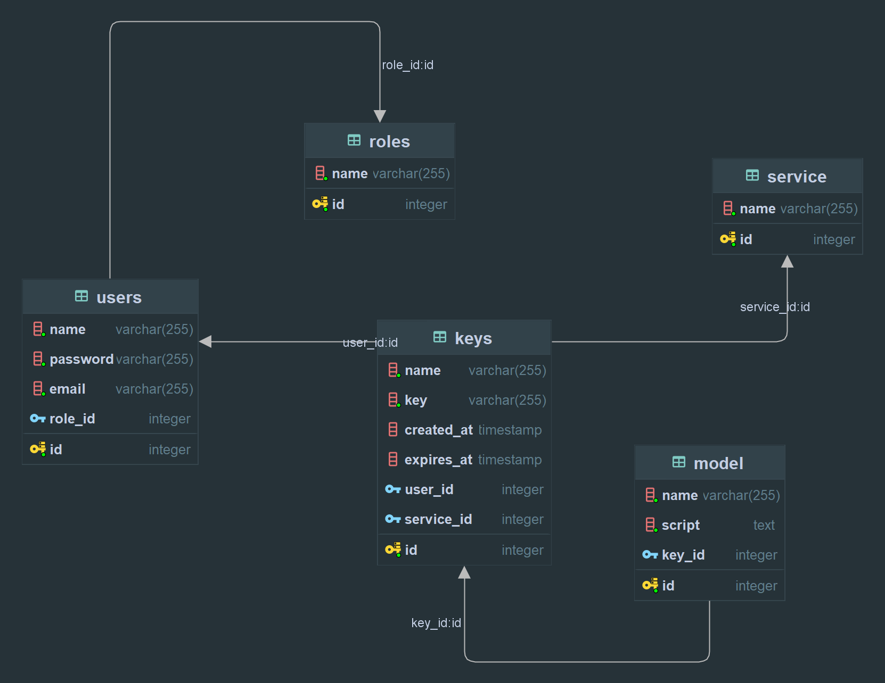

## DATABASE_STRUCTURE

### Database Structure

The database file is located in the `src/main/resources` directory.

It is a single file that contains the database structure and some data needed for the initial setup.

In this project at the moment is not implemented a database migration tool, so you have to create the database manually.\
And update the database code in case of any changes in the database structure.\
If you want, you can use the database migration tool like Flyway or Liquibase.

The database structure is as follows:

